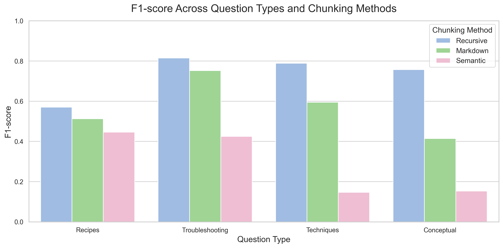
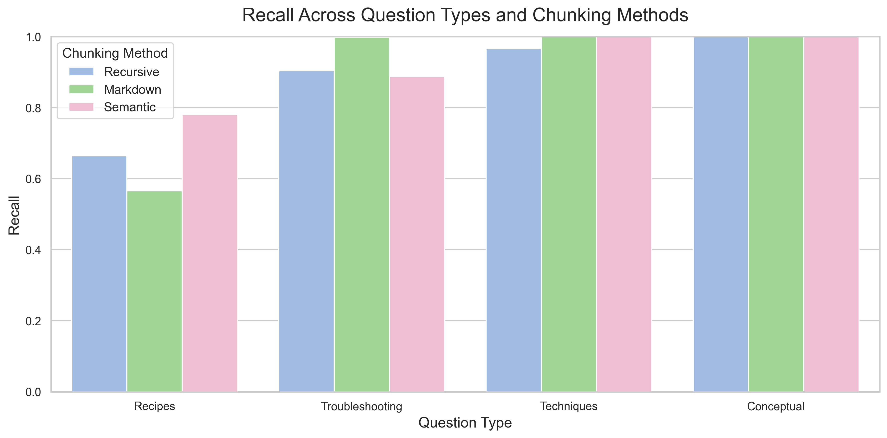
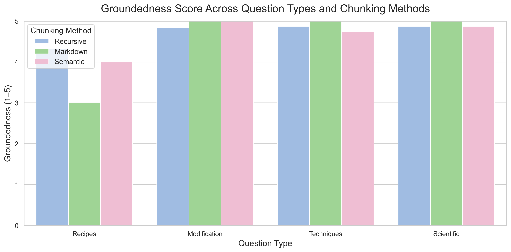

# Baking Assistant Chatbot: Chunking Strategies & Westernisation Bias in RAG

A Retrieval-Augmented Generation (RAG) chatbot that provides baking guidance, built to
investigate two questions:

1. **How do different chunking strategies affect retrieval and answer quality** in a RAG
   system for baking questions?
2. **Can prompt engineering mitigate westernisation bias** in a baking chatbot, and how
   does that affect user trust and preference?

Full write-up, methodology, and results: [`Report_on_cooking_chat_bot.pdf`](./Report_on_cooking_chat_bot.pdf).

---

## Project summary

- **Knowledge base:** ~8,000 words of trusted baking content, stored as a Markdown file.
- **Embeddings:** OpenAI `text-embedding-3-small`.
- **Retrieval:** Cosine similarity, top-4 chunks.
- **LLM:** `gpt-5-nano` for chatbot responses, `GPT-4o-mini` as an LLM-as-judge evaluator.
- **Interface:** Gradio.
- **Chunking methods compared:** Recursive fixed-size, Markdown-header-based, and
  Semantic (embedding-based) chunking.
- **Bias study:** Baseline system prompt vs. a culturally-inclusive system prompt, tested
  on 10 culturally-neutral prompts and validated with an 8-participant user study.

**Headline findings:** Recursive chunking produced the highest-quality chunks and lowest
latency, though downstream answer quality was similar across all three methods due to
high recall. 

The baseline model defaulted to Western recipes in 9/10 culturally-neutral
prompts; a culturally-inclusive system prompt eliminated this default (0% Western-default
rate, 4.3 regions mentioned on average) and was preferred by 6/8 study participants. These findings highlight the importance of designing systems that are responsive to users’ needs while supporting diverse cultural values and preferences.

---

## Repository structure

```text
.
├── README.md
├── requirements.txt
├── Report_on_cooking_chat_bot.pdf          # Full write-up of of the study (Aims, Method, Results)
├── Figures                                 # Study's main Figures
│
├── data/                                   # Baking knowledge base (~8,000 words, Markdown)
├── to_create_vector_database.ipynb         # Chunks + embeds data/ into Chroma
├── chroma_db/                              # Persisted vector database used by the chatbot
├── chatbot_interface.ipynb                 # Gradio baking chatbot (baseline + culturally-inclusive prompts)
│
├── chunking_evaluation/                    # Study 1: recursive vs. markdown vs. semantic chunking
│   ├── to_evaluate_different_chunking.ipynb
│   ├── Batch_test_1_mix.json               # 10 general baking dialogues (56 turns)
│   ├── Batch_test_1_results/
│   ├── Batch_test_2_specific.json          # 8 dialogues across 4 question types (64 turns)
│   └── Batch_test_2_results/
│
└── cultural_bias_evaluation/               # Study 2: Western-default bias and prompt mitigation
    ├── culturally_neutral_test_set.json    # 10 culturally neutral baking prompts
    ├── culturally_neutral_test_..._model_performance.json   # Baseline model results
    └── culturally_neutral_test_..._cultural_model.json      # Culturally-inclusive model results
```


## Running the Code

### Prerequisites
- Python 3.10+
- An OpenAI API key (for embeddings and the chatbot LLM)

### Setup

```bash
git clone <this-repo-url>
cd <this-repo>
pip install -r requirements.txt
```

Set your API key as an environment variable:

```bash
export OPENAI_API_KEY="your-key-here"
```

### Usage

1. **Build the vector database:**
   Open and run `to_create_vector_database.ipynb` top to bottom. This populates `chroma_db/`. It uses the data in the `data` folder to create the database. You can add or modify the data in this folder to suit your needs.

2. **Reproduce the chunking evaluation:**
   Open and run `to_evaluate_different_chunking.ipynb`. This reads
   `Batch_test_1_mix.json` / `Batch_test_2_specific.json` and writes results into
   `Batch_test_1_results/` / `Batch_Test_2_Results/`. 
   In fact, if you open these two folders (`Batch_test_1_results/` and `Batch_Test_2_Results/`) you will see the results (chatbot responses) obtained in this study.

3. **Reproduce the westernisation-bias evaluation:**
  
   **Launch the chatbot:**
   If you open jupyter notebook `chatbot_interface.ipynb` and run in the terminal window:
   
   ```bash
   jupyter notebook chatbot_interface.ipynb
   ```
   It will run all cells and a local Gradio link will be printed for interacting with the assistant. Alternatively you can run each cell of the notebook separately to create or test specific verisions of the chatbot.

   Either way, the `chatbot_interface.ipynb` notebook contains cells for:
   - Creating and running different versions of the chatbot
   - Logging conversations
   - Automatically testing the chatbot for Westernisation bias

   The chatbot responses are saved as JSON files. The `cultural_bias_evaluation` folder contains the test prompts and results from the study.
---

## Results Of Study Summarised

### Study 1: Chunking methods

Recursive chunking produced the highest-quality chunks across every question type. Semantic chunking created large chunks that captured the right content (high recall) but diluted it with irrelevant text, which hurt precision and F1.



| Chunking method | Precision | Recall | F1 | IoU | ROUGE-L | Groundedness | Correctness | Helpfulness |
|---|---|---|---|---|---|---|---|---|
| **Recursive** (700 chars, 100 overlap) | **0.70** | 0.91 | **0.75** | **0.65** | **0.71** | **4.70** | 4.40 | 4.40 |
| Markdown (by heading) | 0.58 | 0.90 | 0.63 | 0.53 | 0.59 | 4.58 | 4.23 | 4.36 |
| Semantic (embedding-based) | 0.22 | **0.94** | 0.28 | 0.18 | 0.21 | **4.70** | **4.42** | **4.52** |

*Token-level metrics measure retrieval quality. LLM-as-judge scores (1–5, GPT-4o-mini) measure answer quality.*

**Key finding:** chunk quality did not predict answer quality. Recall was high for all three methods, so the relevant information was almost always retrieved, and the LLM filtered out the surrounding noise. Recursive chunking is recommended because it matches the others on answer quality while producing smaller, cheaper-to-process chunks.

<details>
<summary>Supporting charts: recall and groundedness by question type</summary>

Recall was lowest for recipe questions, where recipes were split across chunks or confused with similar recipes.



Groundedness dipped only for recipe questions, the same place recall was lowest. Elsewhere, high recall was enough for well-grounded answers.



</details>

### Study 2: Westernisation bias

The knowledge base contains only Western baking sources. On 10 culturally neutral prompts, the baseline chatbot defaulted to Western baking 9 times out of 10. Adding explicit cultural values to the system prompt removed the Western default entirely.

| Model | Western default rate | Avg. regions mentioned | Acknowledged limitations |
|---|---|---|---|
| Baseline | 90% | 1.5 | 0% |
| Culturally inclusive prompt | **0%** | **4.3** | 0% |

**User study** (8 participants, 5-point Likert scale, mean with SD in brackets):

| Measure | Baseline | Culturally inclusive |
|---|---|---|
| Usability composite | 4.45 (0.27) | **4.75** (0.23) |
| Enjoyed interacting | 4.50 (0.76) | **5.00** (0.00) |
| Friendly & approachable | 4.13 (0.84) | **4.88** (0.35) |
| Helpful answers | **4.50** (0.76) | 4.25 (0.46) |
| Variety of baking traditions | 2.38 (1.06) | **4.50** (1.07) |
| Trust for multicultural recipes | 3.38 (0.92) | **4.50** (0.76) |
| Not Western-focused (reverse-coded) | 1.00 (0.93) | **4.37** (0.74) |
| Honest about limitations | 3.13 (1.13) | 3.13 (1.13) |

6 of 8 participants preferred the culturally inclusive chatbot. Neither model acknowledged gaps in its knowledge, so transparency remains an open problem.

See the [full report](Report_on_cooking_chat_bot.pdf) for methods, discussion and limitations.

## Notes / limitations

- The knowledge base is Western-only by construction; the culturally-inclusive prompt
  mitigates surface-level defaulting but does not guarantee cultural accuracy.
- Neither system prompt led the model to acknowledge knowledge limitations.
- The user study is small (n=8) and intended as an exploratory signal, not a definitive result.